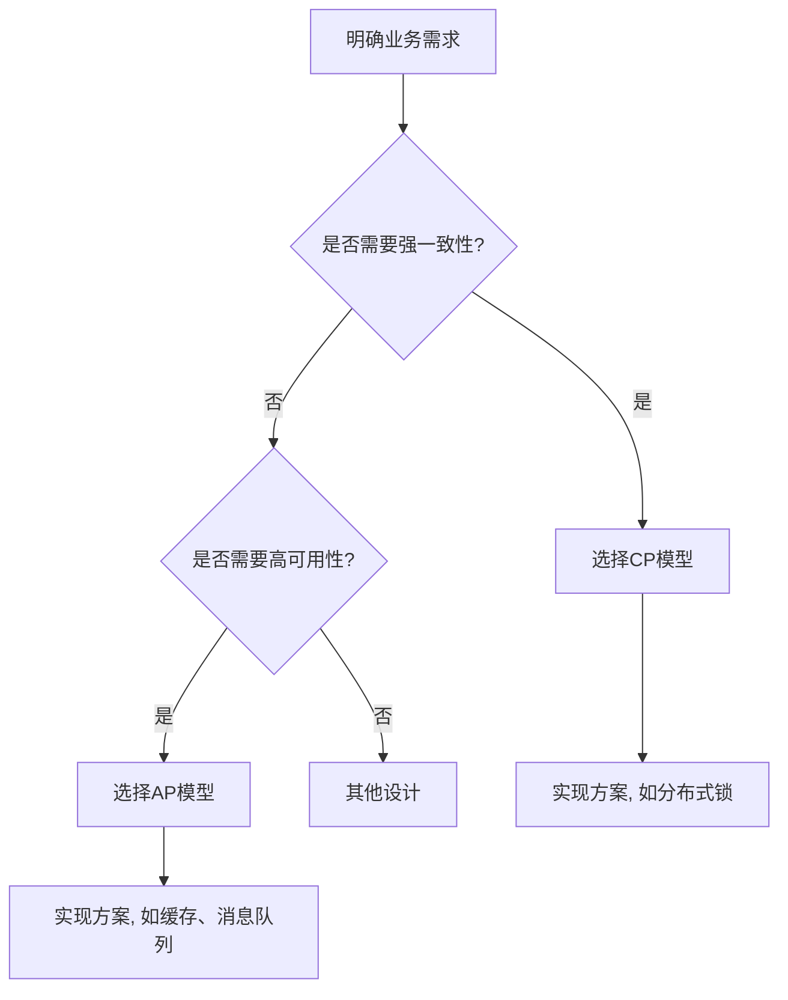

> 在一次面试经历中,被问到了Base理论和CAP理论,我没有想到会问的这么深,不仅仅是要把Base理论和CAP理论是什么讲出来,还要讲出来自己对这2个理论的理解及应用

### CAP是什么?

- C(Consistency)：一致性。服务A、B、C三个节点都存储了用户数据，三个节点的数据都需要保持同一时刻数据一致性。(一致性被称为原子对象，任何的读写都应该看起来是“原子”的，或串行的，写后面的读一定能读到前面写的内容，所有的读写请求都好像被全局排序)
- A(Availability)：可用性。服务A、B、C三个节点，其中一个节点如果宕机了，不能影响整个集群对外提供服务。云服务的SLA协议,即服务水平协议,99.9%类似的
- P(Partition Tolerance)：分区容忍性。指“当部分节点出现消息丢失或者分区故障的时候，分布式系统仍然能够继续运行”，即系统容忍网络出现分区，并且在遇到某节点或网络分区之间网络不可达的情况下，仍然能够对外提供满足一致性和可用性的服务。

:::note
证明了 CAP 理论的 Lynch 教授此时给当时的 IT 界来了一记惊雷：
Lynch 教授通过不可辩驳的证明告诉业界的工程师们，如果在一个不稳定(消息要么乱序要么丢了)的网络环境里(分布式异步模型)，想始终保持数据一致是不可能的。
这是个什么概念呢？就是她打破了那些既想提供超高质量服务，又想提供超高性能服务的技术人员的幻想。
:::

CAP理论的本质是在告诉大家，在分布式系统里，需要妥协。

### CAP理论的应用
以电商系统举例
- 对于商品价格要强一致性
- 对于用户对商品的评价,可以不追求强一致

#### CP架构: 放弃可用性，追求一致性和分区容错性。
- ZooKeeper，就是采用了 CP 一致性，ZooKeeper 是一个分布式的服务框架，主要用来解决分布式集群中应用系统的协调和一致性问题。其核心算法是 Zab，所有设计都是为了一致性。在 CAP 模型中，ZooKeeper 是 CP，这意味着面对网络分区时，为了保持一致性，它是不可用的。

#### AP架构: 对于AP来说，放弃强一致性，追求分区容错性和可用性，这是很多分布式系统设计时的选择，后面的Base也是根据AP来扩展的
和 ZooKeeper 相对的是 Eureka，Eureka 是 Spring Cloud 微服务技术栈中的服务发现组件，Eureka 的各个节点都是平等的，几个节点挂掉不影响正常节点的工作，剩余的节点依然可以提供注册和查询服务，只要有一台 Eureka 还在，就能保证注册服务可用，只不过查到的信息可能不是最新的版本，不保证一致性。

[点击前往Base理论](/software-engineer/distributed/base)

### 架构设计思考路径图

